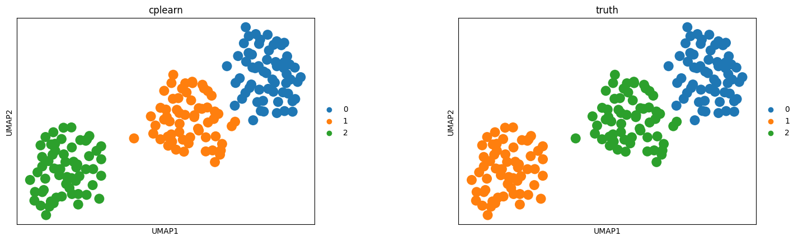

Integrating Analysis with Core Layers
======================================

This section demonstrates how to alternate between different analysis methods. You can mix and match clustering methods (Leiden, Louvain, Cplearn) with visualization methods (UMAP, Coremap), and also combine core analysis with different clustering methods.

We provide several examples below:

Workflow A: Core Analysis + Cplearn Clustering + Coremap Visualization
~~~~~~~~~~~~~~~~~~~~~~~~~~~~~~~~~~~~~~~~~~~~~~~~~~~~~~~~~~~~~~~~~~~~~~~

This workflow uses cplearn's core-periphery learning approach. The new unified workflow is: **core_analyze -> clustering -> visualization**.

.. code-block:: python

    import lotus as lt
    from lotus.workflows.preprocessing import preprocess
    from lotus.workflows.core_analysis import core_analyze
    from lotus.workflows.visualization import coremap
    
    # 1. Load data (using demo dataset)
    adata = lt.read("data/demo_data.h5ad")
    
    # 2. Preprocessing (same as standard workflow)
    preprocess(adata, n_pcs=20, n_top_genes=2000, n_neighbors=15, save_raw=True)
    
    # 3. Core Analysis: Identify core cells, compute clustering, and core map embedding
    #    If model=None, core_analyze automatically calls cplearn.corespect() internally
    model = core_analyze(
        adata,
        use_rep="X_latent",  # or "X_pca"
        key_added="X_cplearn_coremap",
        stable={"core_frac": 0.25, "ng_num": 8},
        cluster={"resolution": 1.2},
        propagate=True,  # Enable propagation for slider support
    )
    
    # 4. Visualization: Use coremap instead of UMAP
    coremap(
        adata,
        coremap_key="X_cplearn_coremap",
        cluster_key="cplearn",
        output_dir="./results",
        save="_cplearn_coremap.html",
        model=model,
    )
    
    print(" Cplearn workflow complete!")
    print(f"  - Clusters: {adata.obs['cplearn'].nunique()}")
    print(f"  - Core map embedding: adata.obsm['X_cplearn_coremap']")

Example output visualization:

The interactive coremap visualization below was generated using the demo dataset (`data/demo_data.h5ad`):

.. note::

   The coremap visualization generates an interactive HTML file with Plotly. 
   The HTML file is self-contained (includes all Plotly.js libraries) and works directly on GitHub Pages.
   
   **View the interactive visualization:** 
   `coremap_cplearn_workflow.html <_static/examples/coremap_cplearn_workflow.html>`_
   
   The HTML file is accessible at: 
   ``https://crossomics.github.io/Lotus/_static/examples/coremap_cplearn_workflow.html``
   
   You can also download and open it locally in your browser for full interactivity.

Workflow B: Scanpy Louvain + UMAP Visualization
~~~~~~~~~~~~~~~~~~~~~~~~~~~~~~~~~~~~~~~~~~~~~~~~~~

This workflow uses standard scanpy methods:

.. code-block:: python

    import lotus as lt
    from lotus.workflows.preprocessing import preprocess
    from lotus.workflows.visualization import umap
    from lotus.workflows.clustering import louvain
    
    # 1. Load data (using demo dataset)
    adata = lt.read("data/demo_data.h5ad")
    
    # 2. Preprocessing (same as standard workflow)
    preprocess(adata, n_pcs=20, n_top_genes=2000, n_neighbors=15, save_raw=True)
    
    # 2. Clustering: Use Louvain (scanpy)
    louvain(
        adata,
        resolution=0.5,
        key_added="louvain",
    )
    
    # 3. Visualization: Use UMAP (scanpy)
    umap(
        adata,
        cluster_key="louvain",
        output_dir="./results",
        save="_louvain_umap.png",
    )
    
    print("Scanpy workflow complete!")
    print(f"  - Clusters: {adata.obs['louvain'].nunique()}")
    print(f"  - UMAP embedding: adata.obsm['X_umap']")

Example output visualization:

The visualization below was generated using the demo dataset (`data/demo_data.h5ad`) with the Louvain workflow:

.. figure:: _static/examples/umap_alternating_louvain.png
   :alt: UMAP visualization from Louvain workflow
   :width: 600px
   :align: center

   UMAP visualization colored by Louvain clusters from the scanpy workflow example, generated using `data/demo_data.h5ad`.

Workflow C: Core Analysis + Cplearn Clustering + UMAP Visualization
~~~~~~~~~~~~~~~~~~~~~~~~~~~~~~~~~~~~~~~~~~~~~~~~~~~~~~~~~~~~~~~~~~~~~~

This workflow combines core analysis (cplearn clustering) with UMAP visualization, giving you the benefits of cplearn's core-periphery learning with the familiar UMAP visualization:

.. code-block:: python

    import lotus as lt
    from lotus.workflows.preprocessing import preprocess
    from lotus.workflows.core_analysis import core_analyze
    from lotus.workflows.visualization import umap
    
    # 1. Load data (using demo dataset)
    adata = lt.read("data/demo_data.h5ad")
    
    # 2. Preprocessing
    preprocess(adata, n_pcs=20, n_top_genes=2000, n_neighbors=15, save_raw=True)
    
    # 3. Core Analysis: Automatically does cplearn clustering internally
    model = core_analyze(
        adata,
        use_rep="X_latent",
        key_added="X_cplearn_coremap",
        stable={"core_frac": 0.3, "ng_num": 10},
        cluster={"resolution": 0.8},
        propagate=True,  # Enable propagation to generate multiple layers for slider
    )
    
    # 4. Visualization: Use UMAP with cplearn clusters
    umap(
        adata,
        cluster_key="cplearn",  # Use cplearn cluster labels
        output_dir="./results",
        save="_cplearn_umap.png",
    )
    
    print(" Core Analysis + Cplearn + UMAP workflow complete!")
    print(f"  - Clusters: {adata.obs['cplearn'].nunique()}")
    print(f"  - UMAP embedding: adata.obsm['X_umap']")
    print(f"  - Core map embedding: adata.obsm['X_cplearn_coremap']")

Example output visualization:

   UMAP visualization colored by cplearn clusters, combining cplearn's clustering with UMAP visualization, generated using `data/demo_data.h5ad`.

Workflow D: Core Analysis + Louvain Clustering + Coremap Visualization
~~~~~~~~~~~~~~~~~~~~~~~~~~~~~~~~~~~~~~~~~~~~~~~~~~~~~~~~~~~~~~~~~~~~~~~~~

This workflow uses core analysis to compute the core map embedding, but applies Louvain clustering instead of cplearn clustering, then visualizes with coremap. The unified workflow is: **core_analyze -> louvain -> coremap**.

.. code-block:: python

    import lotus as lt
    from lotus.workflows.preprocessing import preprocess
    from lotus.workflows.core_analysis import core_analyze
    from lotus.workflows.clustering import louvain
    from lotus.workflows.visualization import coremap
    
    # 1. Load data (using demo dataset)
    adata = lt.read("data/demo_data.h5ad")
    
    # 2. Preprocessing
    preprocess(adata, n_pcs=20, n_top_genes=2000, n_neighbors=15, save_raw=True)
    
    # 3. Core Analysis: Automatically does cplearn clustering internally (for core identification)
    #    Note: This will create adata.obs['cplearn'], but we'll use louvain clusters for visualization
    model = core_analyze(
        adata,
        use_rep="X_latent",
        key_added="X_louvain_coremap",
        stable={"core_frac": 0.3, "ng_num": 10},
        cluster={"resolution": 0.8},
        propagate=True,  # Enable propagation to generate multiple layers for slider
    )
    
    # 4. Louvain clustering (user prefers louvain over cplearn clustering)
    louvain(adata, resolution=0.8, key_added="louvain")
    
    # 5. Visualization: Coremap with louvain clusters
    coremap(
        adata,
        coremap_key="X_louvain_coremap",
        cluster_key="louvain",  # Use louvain clusters instead of cplearn
        output_dir="./results",
        save="coremap_louvain_workflow.html",
        model=model,
    )
    
    print(" Core Analysis + Louvain + Coremap workflow complete!")
    print(f"  - Clusters: {adata.obs['louvain'].nunique()}")
    print(f"  - Core map embedding: adata.obsm['X_louvain_coremap']")

Example output visualization:

View the interactive coremap visualization: 
`coremap_louvain_workflow.html <_static/examples/coremap_louvain_workflow.html>`_

The HTML file is accessible at: 
``https://crossomics.github.io/Lotus/_static/examples/coremap_louvain_workflow.html``

Workflow E: Core Analysis + Louvain Clustering + UMAP Visualization
~~~~~~~~~~~~~~~~~~~~~~~~~~~~~~~~~~~~~~~~~~~~~~~~~~~~~~~~~~~~~~~~~~~~~

This workflow combines core analysis with Louvain clustering and UMAP visualization. The unified workflow is: **core_analyze -> louvain -> umap**.

.. code-block:: python

    import lotus as lt
    from lotus.workflows.preprocessing import preprocess
    from lotus.workflows.core_analysis import core_analyze
    from lotus.workflows.clustering import louvain
    from lotus.workflows.visualization import umap
    
    # 1. Load data (using demo dataset)
    adata = lt.read("data/demo_data.h5ad")
    
    # 2. Preprocessing
    preprocess(adata, n_pcs=20, n_top_genes=2000, n_neighbors=15, save_raw=True)
    
    # 3. Core Analysis: Automatically does cplearn clustering internally (for core identification)
    #    Note: This will create adata.obs['cplearn'], but we'll use louvain clusters for visualization
    model = core_analyze(
        adata,
        use_rep="X_latent",
        key_added="X_louvain_coremap",
        stable={"core_frac": 0.3, "ng_num": 10},
        cluster={"resolution": 0.8},
        propagate=True,  # Enable propagation to generate multiple layers for slider
    )
    
    # 4. Louvain clustering (user prefers louvain over cplearn clustering)
    louvain(adata, resolution=0.8, key_added="louvain")
    
    # 5. Visualization: UMAP with louvain clusters
    umap(
        adata,
        cluster_key="louvain",
        output_dir="./results",
        save="_louvain_umap.png",
    )
    
    print(" Core Analysis + Louvain + UMAP workflow complete!")
    print(f"  - Clusters: {adata.obs['louvain'].nunique()}")
    print(f"  - UMAP embedding: adata.obsm['X_umap']")
    print(f"  - Core map embedding: adata.obsm['X_louvain_coremap']")

Example output visualization:

.. figure:: _static/examples/umap_coreanalysis_louvain_workflow.png
   :alt: UMAP visualization with core analysis and louvain clusters
   :width: 600px
   :align: center

   UMAP visualization colored by Louvain clusters, with core analysis embedding computed using `data/demo_data.h5ad`.

Alternating Between Methods in the Same Workflow
~~~~~~~~~~~~~~~~~~~~~~~~~~~~~~~~~~~~~~~~~~~~~~~~~

You can run both workflows on the same data to compare results. The unified workflow pattern is: **core_analyze -> clustering -> visualization**.

.. code-block:: python

    import lotus as lt
    from lotus.workflows.preprocessing import preprocess
    from lotus.workflows.core_analysis import core_analyze
    from lotus.workflows.clustering import louvain
    from lotus.workflows.visualization import umap, coremap
    
    # 1. Load data (using demo dataset)
    adata = lt.read("data/demo_data.h5ad")
    
    # 2. Preprocessing (shared by both workflows)
    preprocess(adata, n_pcs=20, n_top_genes=2000, n_neighbors=15, save_raw=True)
    
    # === Workflow A: Cplearn ===
    # 3. Core analysis + cplearn clustering (automatic)
    model = core_analyze(
        adata,
        use_rep="X_latent",
        key_added="X_cplearn_coremap",
        stable={"core_frac": 0.25, "ng_num": 8},
        cluster={"resolution": 1.2},
        propagate=True,
    )
    
    # 4. Cplearn visualization (coremap)
    coremap(
        adata,
        coremap_key="X_cplearn_coremap",
        cluster_key="cplearn",
        output_dir="./results",
        save="_cplearn.html",
        model=model,
    )
    
    # === Workflow B: Scanpy ===
    # 5. Louvain clustering
    louvain(adata, resolution=0.5, key_added="louvain")
    
    # 6. Scanpy visualization (UMAP)
    umap(adata, cluster_key="louvain", output_dir="./results", save="_louvain.png")
    
    # === Compare Results ===
    print("Cplearn clusters:", adata.obs['cplearn'].value_counts())
    print("Louvain clusters:", adata.obs['louvain'].value_counts())
    
    # Both cluster keys can be used for DEG analysis
    from lotus.workflows.deg_analysis import rank_genes_groups, marker_genes
    
    # Use scanpy method with Louvain clusters
    rank_genes_groups(adata, groupby="louvain", method="wilcoxon")
    
    # Or use cplearn method with cplearn clusters
    marker_genes(adata, cluster_key="cplearn", layer="raw_counts")

Example output visualizations:

**Cplearn Coremap (Interactive HTML):**

View the interactive coremap visualization: 
`coremap_alternating_cplearn.html <_static/examples/coremap_alternating_cplearn.html>`_

The HTML file is accessible at: 
``https://crossomics.github.io/Lotus/_static/examples/coremap_alternating_cplearn.html``

**Louvain UMAP (Static PNG):**

.. figure:: _static/examples/umap_alternating_louvain.png
   :alt: UMAP visualization from alternating methods Louvain workflow
   :width: 600px
   :align: center

   UMAP visualization colored by Louvain clusters from the alternating methods example, generated using `data/demo_data.h5ad`.

