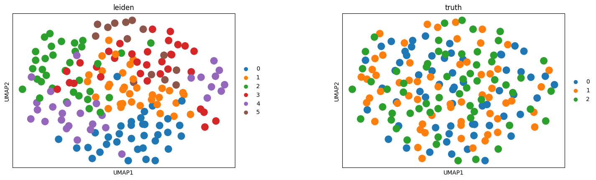

Quick Start
============

This guide provides three quick start paths for using Lotus:

1. **Installation** - Install Lotus package and Interactive Lotus Embedding Projector
2. **Standard Scanpy Workflow** - Preprocess → Clustering → Visualization → DEG Analysis
3. **Alternating Methods** - Switch between core analysis + cplearn vs scanpy methods

.. _installation:

1. Installation
---------------

Clone the Repository
~~~~~~~~~~~~~~~~~~~~

First, clone the Lotus repository:

.. code-block:: bash

    git clone https://github.com/CrossOmics/Lotus.git
    cd Lotus

Install Lotus Package
~~~~~~~~~~~~~~~~~~~~~

Install the Lotus package in development mode:

.. code-block:: bash

    pip install -e .

Install Interactive Lotus Embedding Projector
~~~~~~~~~~~~~~~~~~~~~~~~~~~~~~~~~~~~~~~~~~~~~~

The Interactive Lotus Embedding Projector is a web-based tool for real-time data exploration and visualization. To set it up locally (assuming you're already in the Lotus repository directory):

.. code-block:: bash

    cd Interactive-Lotus

    # Create virtual environment
    python3 -m venv venv

    # Activate virtual environment
    source venv/bin/activate  # On Windows: venv\Scripts\activate

    # Install dependencies
    pip install -r requirements.txt

    # Install Lotus (in development mode from parent directory)
    pip install -e .. --no-deps

    # Run the application
    python3 app.py

Then open your browser and navigate to: http://localhost:5000

.. note::

   We also provide a `lightweight web demo <https://huggingface.co/spaces/zzq1zh/Lotus-hf>`_ for demonstration. 
   However, due to computational resource limitations, the web demo only supports very small datasets.

.. _standard_workflow:

2. Standard Scanpy Workflow
-----------------------------

This section demonstrates the standard single-cell analysis workflow using Lotus's high-level wrappers, which are compatible with scanpy's API.

Import Required Modules
~~~~~~~~~~~~~~~~~~~~~~~

.. code-block:: python

    import lotus as lt
    from lotus.workflows import (
        preprocess,
        leiden,  # or louvain
        umap,
        rank_genes_groups,  # or marker_genes
    )
    from anndata import AnnData

Step 1: Load Data
~~~~~~~~~~~~~~~~~

Load your single-cell data. Lotus supports various data formats through anndata:

.. code-block:: python

    # Load from 10x Genomics H5 format
    # adata = lt.read_10x_h5("path/to/data.h5")
    
    # Or load from AnnData H5AD format
    # adata = lt.read("path/to/data.h5ad")
    
    # Or use scanpy's read functions
    # import scanpy as sc
    # adata = sc.read_10x_mtx("path/to/folder")

Step 2: Preprocessing
~~~~~~~~~~~~~~~~~~~~~~

Preprocessing includes quality control, filtering, normalization, highly variable gene selection, scaling, PCA, and neighbor graph construction:

.. code-block:: python

    preprocess(
        adata,
        n_pcs=20,
        target_sum=1e4,
        n_top_genes=2000,
        n_neighbors=15,
        save_raw=True,
    )

This step performs:
- Quality control metrics (QC metrics) calculation
- Filters low-quality cells and genes
- Normalizes data and applies log transformation
- Selects highly variable genes (HVG)
- Performs principal component analysis (PCA)
- Builds the neighbor graph

After preprocessing, check the results:

.. code-block:: python

    print(f" Preprocessing complete")
    print(f"  - Data shape: {adata.shape}")
    print(f"  - PCA stored in: `adata.obsm['X_pca']`")
    print(f"  - Neighbors graph constructed: {'neighbors' in adata.uns}")

Step 3: Clustering
~~~~~~~~~~~~~~~~~~

Lotus supports multiple clustering methods. For the standard scanpy workflow, use Leiden or Louvain:

**Option A: Leiden Clustering (Recommended)**

.. code-block:: python

    leiden(
        adata,
        resolution=0.5,
        key_added="leiden",
    )
    
    print(f"Found {adata.obs['leiden'].nunique()} clusters")

**Option B: Louvain Clustering**

.. code-block:: python

    from lotus.workflows import louvain
    
    louvain(
        adata,
        resolution=0.5,
        key_added="louvain",
    )
    
    print(f"Found {adata.obs['louvain'].nunique()} clusters")

Step 4: Visualization
~~~~~~~~~~~~~~~~~~~~~

Generate UMAP visualization of clustering results:

.. code-block:: python

    umap(
        adata,
        cluster_key="leiden",  # or "louvain"
        output_dir="./results",
        save="_clusters.png",
    )

This step computes UMAP dimensionality reduction and generates visualization plots. The UMAP embedding is stored in `adata.obsm['X_umap']`.

Step 5: Differential Expression Analysis
~~~~~~~~~~~~~~~~~~~~~~~~~~~~~~~~~~~~~~~~~~

Find marker genes between clusters using scanpy's method:

.. code-block:: python

    from lotus.workflows import rank_genes_groups
    
    rank_genes_groups(
        adata,
        groupby="leiden",  # or "louvain"
        method="wilcoxon",
        key_added="rank_genes_groups",
    )
    
    # View top marker genes for each cluster
    import pandas as pd
    result = pd.DataFrame(adata.uns['rank_genes_groups']['names']).head(5)
    print(result)

Complete Standard Workflow Example
~~~~~~~~~~~~~~~~~~~~~~~~~~~~~~~~~~

This example uses the demo dataset included in the repository:

.. code-block:: python

    import lotus as lt
    from lotus.workflows import preprocess, leiden, umap, rank_genes_groups
    
    # 1. Load data (using demo dataset from repository)
    adata = lt.read("data/demo_data.h5ad")
    # Or load your own data:
    # adata = lt.read("path/to/your/data.h5ad")
    
    # 2. Preprocessing
    preprocess(adata, n_pcs=20, n_top_genes=2000, n_neighbors=15, save_raw=True)
    
    # 3. Clustering (Leiden)
    leiden(adata, resolution=0.5, key_added="leiden")
    
    # 4. Visualization
    umap(adata, cluster_key="leiden", output_dir="./results", save="_clusters.png")
    
    # 5. Differential Expression Analysis
    rank_genes_groups(adata, groupby="leiden", method="wilcoxon")
    
    print(" Standard workflow complete!")

Example output visualization:

The visualization below was generated using the demo dataset (`data/demo_data.h5ad`) with the standard workflow:

   UMAP visualization colored by Leiden clusters from the standard workflow example, generated using `data/demo_data.h5ad`.

.. _alternating_methods:

3. Alternating Methods: Mixing Clustering and Visualization Methods
-------------------------------------------------------------------

This section demonstrates how to alternate between different analysis methods. You can mix and match clustering methods (Leiden, Louvain, Cplearn) with visualization methods (UMAP, Coremap), and also combine core analysis with different clustering methods:
We provide several examples below:
Workflow A: Core Analysis + Cplearn Clustering + Coremap Visualization
~~~~~~~~~~~~~~~~~~~~~~~~~~~~~~~~~~~~~~~~~~~~~~~~~~~~~~~~~~~~~~~~~~~~~~~

This workflow uses cplearn's core-periphery learning approach:

.. code-block:: python

    import lotus as lt
    from lotus.workflows import preprocess, core_analyze, coremap
    from lotus.methods.cplearn.external import cplearn
    
    # 1. Load data (using demo dataset)
    adata = lt.read("data/demo_data.h5ad")
    
    # 2. Preprocessing (same as standard workflow)
    preprocess(adata, n_pcs=20, n_top_genes=2000, n_neighbors=15, save_raw=True)
    
    # 3. Core Analysis: Identify core cells and compute core map embedding
    model = cplearn.corespect(
        adata,
        use_rep="X_latent",  # or "X_pca"
        key_added="cplearn",
        stable={"core_frac": 0.25, "ng_num": 8},
        cluster={"resolution": 1.2},
    )
    
    # 4. Compute core map embedding
    core_analyze(
        adata,
        model=model,
        use_rep="X_latent",
        key_added="X_cplearn_coremap",
    )
    
    # 5. Visualization: Use coremap instead of UMAP
    coremap(
        adata,
        coremap_key="X_cplearn_coremap",
        cluster_key="cplearn",
        output_dir="./results",
        save="_cplearn_coremap.html",
    )
    
    print(" Cplearn workflow complete!")
    print(f"  - Clusters: {adata.obs['cplearn'].nunique()}")
    print(f"  - Core map embedding: adata.obsm['X_cplearn_coremap']")

Example output visualization:

The interactive coremap visualization below was generated using the demo dataset (`data/demo_data.h5ad`):

.. note::

   The coremap visualization generates an interactive HTML file with Plotly. 
   The HTML file is self-contained (includes all Plotly.js libraries) and works directly on GitHub Pages.
   
   **View the interactive visualization:** 
   `coremap_cplearn_workflow.html <_static/examples/coremap_cplearn_workflow.html>`_
   
   The HTML file is accessible at: 
   ``https://crossomics.github.io/Lotus/_static/examples/coremap_cplearn_workflow.html``
   
   You can also download and open it locally in your browser for full interactivity.

Workflow B: Scanpy Louvain + UMAP Visualization
~~~~~~~~~~~~~~~~~~~~~~~~~~~~~~~~~~~~~~~~~~~~~~~~~~

This workflow uses standard scanpy methods:

.. code-block:: python

    import lotus as lt
    from lotus.workflows import preprocess, umap, louvain
    
    # 1. Load data (using demo dataset)
    adata = lt.read("data/demo_data.h5ad")
    
    # 2. Preprocessing (same as standard workflow)
    preprocess(adata, n_pcs=20, n_top_genes=2000, n_neighbors=15, save_raw=True)
    
    # 2. Clustering: Use Louvain (scanpy)
    louvain(
        adata,
        resolution=0.5,
        key_added="louvain",
    )
    
    # 3. Visualization: Use UMAP (scanpy)
    umap(
        adata,
        cluster_key="louvain",
        output_dir="./results",
        save="_louvain_umap.png",
    )
    
    print("Scanpy workflow complete!")
    print(f"  - Clusters: {adata.obs['louvain'].nunique()}")
    print(f"  - UMAP embedding: adata.obsm['X_umap']")

Example output visualization:

The visualization below was generated using the demo dataset (`data/demo_data.h5ad`) with the Louvain workflow:

.. figure:: _static/examples/umap_alternating_louvain.png
   :alt: UMAP visualization from Louvain workflow
   :width: 600px
   :align: center

   UMAP visualization colored by Louvain clusters from the scanpy workflow example, generated using `data/demo_data.h5ad`.

Workflow C: Cplearn Clustering + UMAP Visualization
~~~~~~~~~~~~~~~~~~~~~~~~~~~~~~~~~~~~~~~~~~~~~~~~~~~~~

This workflow combines cplearn clustering with UMAP visualization, giving you the benefits of cplearn's core-periphery learning with the familiar UMAP visualization:

.. code-block:: python

    import lotus as lt
    from lotus.workflows import preprocess, umap
    from lotus.methods.cplearn.external import cplearn
    
    # 1. Load data (using demo dataset)
    adata = lt.read("data/demo_data.h5ad")
    
    # 2. Preprocessing
    preprocess(adata, n_pcs=20, n_top_genes=2000, n_neighbors=15, save_raw=True)
    
    # 3. Cplearn clustering
    model = cplearn.corespect(
        adata,
        use_rep="X_latent",
        key_added="cplearn",
        stable={"core_frac": 0.3, "ng_num": 10},
        cluster={"resolution": 0.8},
        propagate=False,
    )
    
    # 4. Visualization: Use UMAP with cplearn clusters
    umap(
        adata,
        cluster_key="cplearn",  # Use cplearn cluster labels
        output_dir="./results",
        save="_cplearn_umap.png",
    )
    
    print(" Cplearn + UMAP workflow complete!")
    print(f"  - Clusters: {adata.obs['cplearn'].nunique()}")
    print(f"  - UMAP embedding: adata.obsm['X_umap']")

Example output visualization:

.. figure:: _static/examples/umap_cplearn_workflow.png
   :alt: UMAP visualization with cplearn clusters
   :width: 600px
   :align: center

   UMAP visualization colored by cplearn clusters, combining cplearn's clustering with UMAP visualization, generated using `data/demo_data.h5ad`.

Workflow D: Core Analysis + Louvain Clustering + Coremap Visualization
~~~~~~~~~~~~~~~~~~~~~~~~~~~~~~~~~~~~~~~~~~~~~~~~~~~~~~~~~~~~~~~~~~~~~~~~~

This workflow uses core analysis to compute the core map embedding, but applies Louvain clustering instead of cplearn clustering, then visualizes with coremap:

.. code-block:: python

    import lotus as lt
    from lotus.workflows import preprocess, louvain, core_analyze, coremap
    from lotus.methods.cplearn.external import cplearn
    
    # 1. Load data (using demo dataset)
    adata = lt.read("data/demo_data.h5ad")
    
    # 2. Preprocessing
    preprocess(adata, n_pcs=20, n_top_genes=2000, n_neighbors=15, save_raw=True)
    
    # 3. Get cplearn model (needed for core analysis, but we'll use louvain clustering)
    model = cplearn.corespect(
        adata,
        use_rep="X_latent",
        key_added="cplearn_temp",
        stable={"core_frac": 0.3, "ng_num": 10},
        cluster={"resolution": 0.8},
        propagate=False,
    )
    
    # 4. Louvain clustering
    louvain(adata, resolution=0.8, key_added="louvain")
    
    # 5. Core analysis using louvain clusters
    core_analyze(
        adata,
        model=model,
        use_rep="X_latent",
        key_added="X_louvain_coremap",
        cluster_key="louvain",  # Use louvain clusters instead of cplearn
    )
    
    # 6. Visualization: Coremap with louvain clusters
    coremap(
        adata,
        coremap_key="X_louvain_coremap",
        cluster_key="louvain",
        output_dir="./results",
        save="coremap_louvain_workflow.html",
        model=model,
    )
    
    print(" Core Analysis + Louvain + Coremap workflow complete!")
    print(f"  - Clusters: {adata.obs['louvain'].nunique()}")
    print(f"  - Core map embedding: adata.obsm['X_louvain_coremap']")

Example output visualization:

View the interactive coremap visualization: 
`coremap_louvain_workflow.html <_static/examples/coremap_louvain_workflow.html>`_

The HTML file is accessible at: 
``https://crossomics.github.io/Lotus/_static/examples/coremap_louvain_workflow.html``

Workflow E: Core Analysis + Louvain Clustering + UMAP Visualization
~~~~~~~~~~~~~~~~~~~~~~~~~~~~~~~~~~~~~~~~~~~~~~~~~~~~~~~~~~~~~~~~~~~~~

This workflow combines core analysis with Louvain clustering and UMAP visualization:

.. code-block:: python

    import lotus as lt
    from lotus.workflows import preprocess, umap, louvain, core_analyze
    from lotus.methods.cplearn.external import cplearn
    
    # 1. Load data (using demo dataset)
    adata = lt.read("data/demo_data.h5ad")
    
    # 2. Preprocessing
    preprocess(adata, n_pcs=20, n_top_genes=2000, n_neighbors=15, save_raw=True)
    
    # 3. Get cplearn model (needed for core analysis, but we'll use louvain clustering)
    model = cplearn.corespect(
        adata,
        use_rep="X_latent",
        key_added="cplearn_temp",
        stable={"core_frac": 0.3, "ng_num": 10},
        cluster={"resolution": 0.8},
        propagate=False,
    )
    
    # 4. Louvain clustering
    louvain(adata, resolution=0.8, key_added="louvain")
    
    # 5. Core analysis using louvain clusters
    core_analyze(
        adata,
        model=model,
        use_rep="X_latent",
        key_added="X_louvain_coremap",
        cluster_key="louvain",  # Use louvain clusters instead of cplearn
    )
    
    # 6. Visualization: UMAP with louvain clusters
    umap(
        adata,
        cluster_key="louvain",
        output_dir="./results",
        save="_louvain_umap.png",
    )
    
    print(" Core Analysis + Louvain + UMAP workflow complete!")
    print(f"  - Clusters: {adata.obs['louvain'].nunique()}")
    print(f"  - UMAP embedding: adata.obsm['X_umap']")
    print(f"  - Core map embedding: adata.obsm['X_louvain_coremap']")

Example output visualization:

.. figure:: _static/examples/umap_coreanalysis_louvain_workflow.png
   :alt: UMAP visualization with core analysis and louvain clusters
   :width: 600px
   :align: center

   UMAP visualization colored by Louvain clusters, with core analysis embedding computed using `data/demo_data.h5ad`.

Alternating Between Methods in the Same Workflow
~~~~~~~~~~~~~~~~~~~~~~~~~~~~~~~~~~~~~~~~~~~~~~~~~

You can run both workflows on the same data to compare results:

.. code-block:: python

    import lotus as lt
    from lotus.workflows import preprocess, umap, leiden, louvain, core_analyze, coremap
    from lotus.methods.cplearn.external import cplearn
    
    # 1. Load data (using demo dataset)
    adata = lt.read("data/demo_data.h5ad")
    
    # 2. Preprocessing (shared by both workflows)
    preprocess(adata, n_pcs=20, n_top_genes=2000, n_neighbors=15, save_raw=True)
    
    # === Workflow A: Cplearn ===
    # 3. Core analysis + cplearn clustering
    model = cplearn.corespect(
        adata,
        use_rep="X_latent",
        key_added="cplearn",
        stable={"core_frac": 0.25, "ng_num": 8},
        cluster={"resolution": 1.2},
    )
    core_analyze(adata, model=model, use_rep="X_latent", key_added="X_cplearn_coremap")
    
    # Cplearn visualization (coremap)
    coremap(adata, coremap_key="X_cplearn_coremap", cluster_key="cplearn", 
            output_dir="./results", save="_cplearn.html")
    
    # === Workflow B: Scanpy ===
    # 4. Louvain clustering
    louvain(adata, resolution=0.5, key_added="louvain")
    
    # 5. Scanpy visualization (UMAP)
    umap(adata, cluster_key="louvain", output_dir="./results", save="_louvain.png")
    
    # === Compare Results ===
    print("Cplearn clusters:", adata.obs['cplearn'].value_counts())
    print("Louvain clusters:", adata.obs['louvain'].value_counts())
    
    # Both cluster keys can be used for DEG analysis
    from lotus.workflows import rank_genes_groups, marker_genes
    
    # Use scanpy method with Louvain clusters
    rank_genes_groups(adata, groupby="louvain", method="wilcoxon")
    
    # Or use cplearn method with cplearn clusters
    marker_genes(adata, cluster_key="cplearn", layer="raw_counts")

Example output visualizations:

**Cplearn Coremap (Interactive HTML):**

View the interactive coremap visualization: 
`coremap_alternating_cplearn.html <_static/examples/coremap_alternating_cplearn.html>`_

The HTML file is accessible at: 
``https://crossomics.github.io/Lotus/_static/examples/coremap_alternating_cplearn.html``

**Louvain UMAP (Static PNG):**

.. figure:: _static/examples/umap_alternating_louvain.png
   :alt: UMAP visualization from alternating methods Louvain workflow
   :width: 600px
   :align: center

   UMAP visualization colored by Louvain clusters from the alternating methods example, generated using `data/demo_data.h5ad`.

